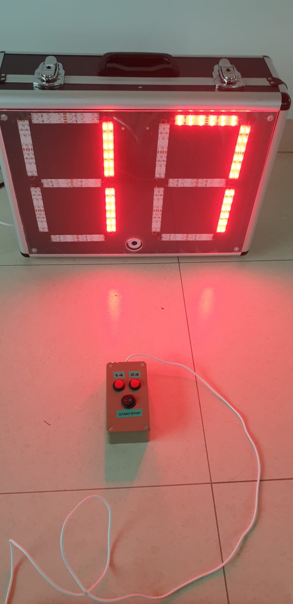
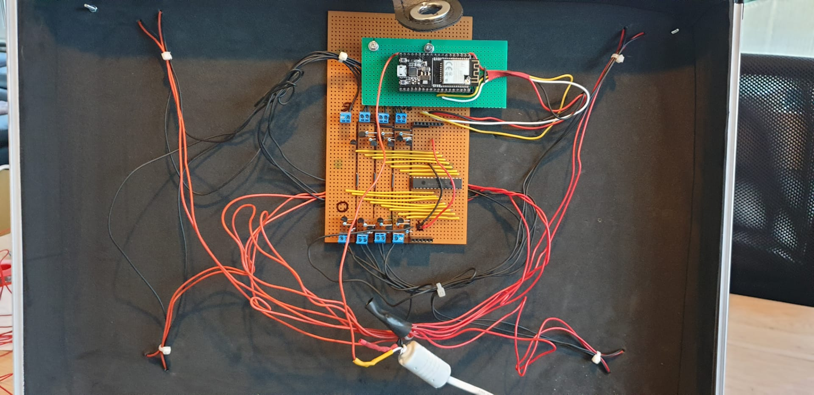

# Basketball 24/14 seconds display and controller on ESP32

## This project is replacing the original project with LORA
When I started the orginal project in 2017, multi-threading on MicroPython and Pycom devices was not a thing.
As a result, I had a lot of issues to have a stable connection between controller and display using WiFi.

With the support of multi-threading in MicroPython, this has changed and this project is now using standard WiFi instead of LORA.

***How does it work?***

**Remote control**

You have a remote with 3 buttons (24, 14, start/stop) build around an ESP32 microboard.
This board is also a WiFi access point so the display will connect to the remote for retreiving his clock information.
The Remote has a primary program running the detection of button changes and the clock routine for counting down.
Besides the primary program, a socket listener is launched in a thread.  To make sure that different displays (even Raspberry devices for HDMI display) can connect simultaneously, this thread will create additional subthreads for the actual connection. 
Note that the remote is not handling the buzzer but is only sending out a dual ASCII string with the actual time.  The buzzer needs to be handled by the display.

The code for the remote can be found in the remote directory.
> small catch when using ESP32 for AP is that you need to specify the encryption "authmode=3" when activating the AP for WPA2 encryption.  Without this, you don't get warnings but the AP will not use any encryption.

**24/14 display with ESP32**

The ESP32 is connected to a I2C MCP23017 chip.  The advantage is that this simplifies the connections to the ESP32.
> Note that additional resistors are required between 3.3v and the SCL and SDA pins.  Without this, you will get strange signals.

